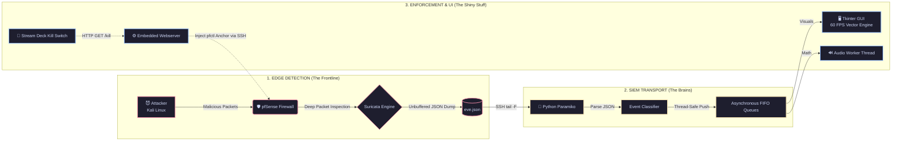
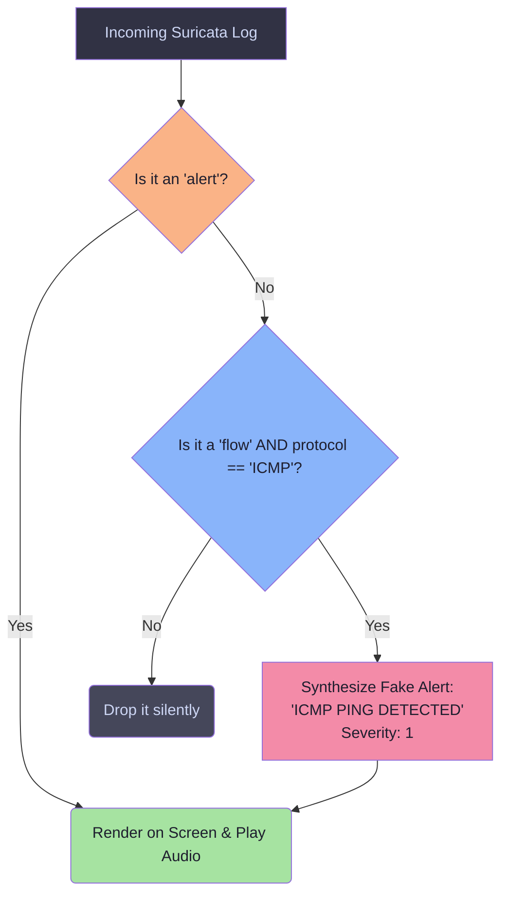
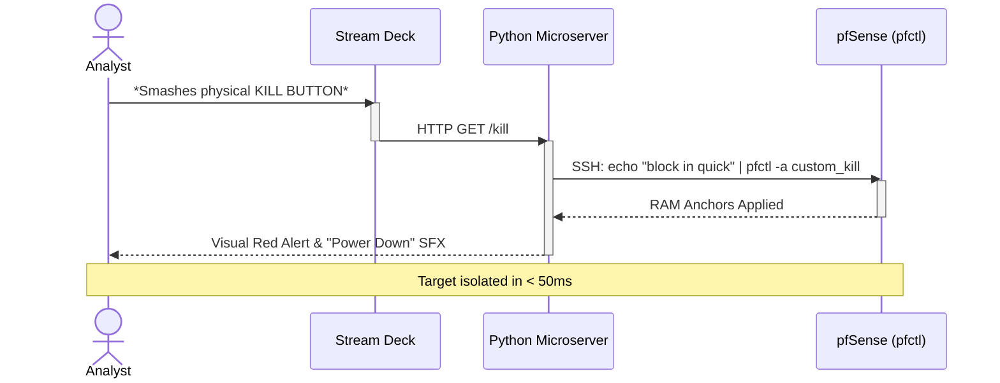

# Sonic SOC Station: Cybernetic Multisensory IDS & Active Defense Platform 🎧🛡️

[](https://www.python.org/)
[](https://www.pfsense.org/)
[](https://suricata.io/)
[](#)

> **Academic Disclaimer:** This is an experimental Proof of Concept (PoC) built as a course project for our Master's degree program in Applied Computer Science. It is not a polished, enterprise-ready SIEM product. Please do not deploy this on a Fortune 500 corporate network unless you actively want to give your CISO a heart attack.

Let's be honest: staring at a terminal window running `tail -f /var/log/suricata.log` until your eyes dry out is an objectively terrible way to spend your shift. 

**Sonic SOC Station** was born out of a desire to make network security monitoring ergonomic, intuitive, and fun. It dynamically ingests real-time Deep Packet Inspection (DPI) telemetry from a perimeter firewall, mathematically translates raw network anomalies into synchronized auditory waveforms and 60 FPS vector visual animations, and provides microsecond-scale hardware isolation via a physical Kill Switch. 

Hear the breach. Smash the button. Save the network.

---

## 📑 Comprehensive Table of Contents
1. [The Problem: Alert Fatigue](#1-the-problem-alert-fatigue)
2. [The Solution: Cybernetic Synesthesia](#2-the-solution-cybernetic-synesthesia)
3. [System Architecture & Deep Packet Flow](#3-system-architecture--deep-packet-flow)
4. [Mathematical Audio Mapping (Musical IDS)](#4-mathematical-audio-mapping-musical-ids)
5. [ICMP Demasking (No More Stealth Pings)](#5-icmp-demasking-no-more-stealth-pings)
6. [Active Defense: The Kill Switch](#6-active-defense-the-kill-switch)
7. [Hardware & Virtual Lab Infrastructure](#7-hardware--virtual-lab-infrastructure)
8. [Core Engine Source Code](#8-core-engine-source-code)
9. [Engineering Post-Mortem & Bottlenecks](#9-engineering-post-mortem--bottlenecks)
10. [The Dream Team](#10-the-dream-team)

---

## 🧠 1. The Problem: Alert Fatigue

Modern Security Operations Centers (SOC) face a systemic, biological bottleneck: **alert fatigue**. 

High-throughput Next-Generation Firewalls (NGFW) generate thousands of structured security logs per hour. Traditional Security Information and Event Management (SIEM) systems force human operators to continuously analyze endless screens of homogenous, text-based data. This legacy architecture relies on active, sustained visual concentration.

Prolonged exposure to this data stream leads to severe cognitive overload and psychological desensitization. When the visual channel becomes saturated:
* **"Snow Blindness" Sets In:** Analysts fail to distinguish between routine administrative noise and lateral movement.
* **Laggy Human Processing:** The time required to visually read an IP, cross-reference the port, and evaluate the severity introduces massive operational lag.
* **Triage Blind Spots:** To cope with the sheer volume of logs, SOC teams implement aggressive filtering rules, actively dropping non-alert events (such as ICMP diagnostic flows). This inadvertently creates critical blind spots during the stealth reconnaissance phases of cyber attacks.

---

## 👁️‍🗨️ 2. The Solution: Cybernetic Synesthesia

Sonic SOC Station establishes a radical alternative ergonomic model designed to bypass visual cognitive overload entirely: **multisensory cybernetic synesthesia**. 

By establishing a direct mathematical bridge between network packet characteristics and psychoacoustic sound design, the network's structural state becomes perceptible as a continuous, ambient acoustic landscape.

* **Passive Background Monitoring:** Human auditory processing operates continuously, omnidirectionally, and subconsciously. You can perform secondary, high-focus analytical tasks (like malware reverse engineering or writing reports) while naturally tracking the acoustic "pulse" of the network in the background. 
* **Acoustic Gestalt Recognition:** Complex cyber-attack patterns form distinct, undeniable acoustic signatures. An Nmap scan creates an escalating arpeggiated frequency sweep, while a volumetric DDoS flood creates chaotic harmonic saturation. The human brain detects these structural anomalies reflexively, alerting the analyst before they even look at a screen.

---

## 🏗️ 3. System Architecture & Deep Packet Flow

To prevent the 60 FPS graphical rendering engine from bottlenecking the high-speed firewall log ingestion, the system is deployed in a strictly distributed, three-tier asynchronous architecture.



### Deep Packet Execution Sequence

1. **Hostile Ingress:** The aggressor emits raw frames toward the targeted host.


2. **Kernel Tap & DPI:** The FreeBSD kernel routes incoming frames to Suricata. Suricata processes both payload signatures and stateful L4 protocol tables, outputting newline-delimited JSON records directly to `eve.json` in unbuffered mode.


3. **Cryptographic Stream Consumption:** The Python application maintains a long-lived SSH connection to the firewall, running `tail -F` filtered by `grep`, catching telemetry in real-time.


4. **Queue-Based Decoupling:** The ingestion engine parses the JSON strings and distributes the objects into thread-safe FIFO buffers (`queue.Queue`), perfectly isolating the CPU-bound graphical math from I/O-bound network polling and audio generation.


---

## 🎵 4. Mathematical Audio Mapping (Musical IDS)

We do not use cheap, pre-recorded MP3 sound effects. The audio is procedurally generated using mathematics, driven directly by the Layer-4 telemetry of the malicious packets.

### The Modulo Normalization Algorithm

To eliminate acoustic shrillness and preserve operator stamina over long monitoring sessions, raw destination ports ($P$) are clamped into a narrow, pleasant acoustic band:

$$f_{\text{base}} = 220 + (P \pmod{500})$$

The modulo operation guarantees that the resulting baseline frequency spectrum spans exactly between **220 Hz and 720 Hz**. This prevents high-pitched, piercing shrieks from causing auditory fatigue.

| The Attack | What's happening? | Psychoacoustic Impact |
| :--- | :--- | :--- |
| **Nmap Port Scan** | Attacker hits sequential ports (22, 80, 443). | A rapid, escalating sequence of ascending musical tones (**a musical arpeggio**). |
| **SYN Flood (hping3)** | 10,000 packets hit Port 80. | A continuous, annoying, **high-pitched alarm**. |
| **ICMP Ping** | No ports in ICMP! We hardcoded it to 440 Hz. | A low, rhythmic **bass thump (a network heartbeat)**. |

## 🔍 5. ICMP Demasking (No More Stealth Pings)

A foundational vulnerability of standard SIEM and IDS deployments is the total omission of simple ICMP Echo Requests. Standard detection engines classify ICMP as routine diagnostic noise, dumping the metadata solely as non-alert `flow` records to conserve database storage.

Because `flow` records don't trigger alarms, an attacker can ping-sweep your entire subnet in total silence. Sonic SOC Station fixes this through the **ICMP Unifier Engine**:



By intercepting connectionless `flow` objects and synthesizing high-priority alerts in RAM, stealth ping sweeps become impossible. The very first packet from an attacker strikes the sound card with a deep bass impulse, unmasking threat actors before vulnerability exploits or port scans can even commence.

---

## ⚡ 6. Active Defense: The Kill Switch

Traditional pfSense web GUI blocking is slow. Executing standard `easyrule` commands requires a full XML configuration reload, which takes 2-5 seconds and ruthlessly drops all active, legitimate sessions on the firewall.

To achieve sub-50ms isolation without disrupting the rest of the network, we bypassed the management stack entirely.



---

## 💻 7. Hardware & Virtual Lab Infrastructure

> ⚠️ **CRITICAL WARNING:** Do not deploy this application on a bridged corporate network. It actively manipulates firewall routing tables. The entire infrastructure must operate within a mathematically closed, virtualized network topology (Internal Network / Host-Only / LAN Segment).

### Lab Appliance Specifications

| Appliance Node | Operating System | Allocated Resources | Operational Responsibilities |
| :--- | :--- | :--- | :--- |
| **Aggressor Node** | Kali Linux | 4 vCPU, 8 GB RAM | Threat actor emulation: Nmap sweeps, hping3 SYN floods. |
| **Security Gateway** | FreeBSD (pfSense) | 4 vCPU, 8 GB RAM | DPI via Suricata, core routing, dynamic state table manipulation (`pfctl`). |
| **Target Host** | Windows 11 Enterprise | 2 vCPU, 4 GB RAM | Protected corporate asset hosting representative target services (`10.0.0.10`). |
| **Operator Console** | Windows (Native Host) | Host Resources | Python 3.10+ ingestion runtime, real-time GUI, hardware Stream Deck integration. |

### Critical System Hardening (Why your logs might be empty)
1. **Hardware Checksum Offload Disabling:** Under pfSense advanced networking settings, **Hardware Checksum Offloading must be disabled**. Otherwise, Suricata will reject packets with invalid virtual checksums generated by the hypervisor, resulting in totally empty log buffers.
2. **Flow Metrology Activation:** Suricata non-alert logging settings must explicitly enable `Flow` capture to dump connectionless network transactions into the JSON output.

### Critical System Hardening (Why your logs might be empty)

1. **Hardware Checksum Offload Disabling:** Under pfSense advanced networking settings, **Hardware Checksum Offloading must be disabled**. Otherwise, Suricata will reject packets with invalid virtual checksums generated by the hypervisor, resulting in totally empty log buffers.


2. **Flow Metrology Activation:** Suricata non-alert logging settings must explicitly enable `Flow` capture to dump connectionless network transactions into the JSON output.


---

## ⌨️ 8. Core Engine Source Code

Here is the complete, unbroken Python engine. It handles multi-threaded SSH ingestion, 60 FPS Tkinter vector rendering, and audio generation without locking the Global Interpreter Lock (GIL).

> **Note:** Ensure that the `PFSENSE_IP`, `SSH_USER`, and `SSH_PASS` variables are securely configured for your isolated lab environment before execution.

```python
import math
import random
import tkinter as tk
import threading
import json
import paramiko
import queue
import time
from http.server import BaseHTTPRequestHandler, HTTPServer
from datetime import datetime

try:
    import winsound
    HAS_WINSOUND = True
except ImportError:
    HAS_WINSOUND = False

# --- CONFIGURATION ---
PFSENSE_IP = "YOUR_PFSENSE_IP"
SSH_USER = "YOUR_SSH_USER"
SSH_PASS = "YOUR_SSH_PASSWORD"
TARGET_IP = "YOUR_TARGET_IP"
KILL_SWITCH_PORT = 5000

WIDTH, HEIGHT = 1400, 900
FPS = 60

COLORS = {
    "bg": "#050508",
    "line": "#1a3a5c",
    "white": "#ffffff",
    "terminal": "#020204",
    "armed": "#00ffcc",
    "disarmed": "#ff0055",
}

# Thread-safe FIFO queues for async data passing
kill_queue = queue.Queue()
audio_queue = queue.Queue()
gui_log_queue = queue.Queue()
alert_queue = queue.Queue()


# --- STREAM DECK HARDWARE API ---
class StreamDeckServer(BaseHTTPRequestHandler):
    def do_GET(self):
        if self.path == "/kill":
            kill_queue.put("TRIGGER")
            self.send_response(200)
        elif self.path == "/restore":
            kill_queue.put("RESTORE")
            self.send_response(200)
        else:
            self.send_response(404)
        self.end_headers()

    def log_message(self, *args):
        # Suppress default HTTP logging to keep console output clean
        pass


# --- ISOLATED AUDIO THREAD ---
# Prevents synchronous audio from locking the Global Interpreter Lock (GIL) and GUI
def audio_worker():
    while True:
        try:
            freq, duration = audio_queue.get(timeout=1)
            if HAS_WINSOUND and freq > 37:
                winsound.Beep(int(freq), int(duration))
            else:
                time.sleep(duration / 1000.0)
        except queue.Empty:
            continue


# --- VECTOR GRAPHICS & PHYSICS ENGINE ---
class CyberParticle:
    def __init__(self, x, y, color):
        self.x, self.y = x, y
        self.color = color
        self.size = random.randint(2, 5)
        self.dx = random.uniform(-5, 5)
        self.dy = random.uniform(-5, 5)
        self.life = 100

    def update(self, canvas):
        self.x += self.dx
        self.y += self.dy
        self.life -= 5

        if self.life <= 0:
            return False

        s = self.size * (self.life / 100)
        canvas.create_oval(self.x - s, self.y - s, self.x + s, self.y + s,
                           fill=self.color, outline="")
        return True


class Shockwave:
    def __init__(self, x, y):
        self.x = x
        self.y = y
        self.radius = 1
        self.alpha = 255

    def draw(self, canvas):
        if self.alpha <= 0:
            return False

        color = f"#{self.alpha:02x}{self.alpha:02x}{self.alpha:02x}"
        canvas.create_oval(
            self.x - self.radius,
            self.y - self.radius,
            self.x + self.radius,
            self.y + self.radius,
            outline=color,
            width=3
        )

        self.radius += 10
        self.alpha -= 8
        return True


class MatrixDrop:
    def __init__(self, x, char):
        self.x = x
        self.y = 0
        self.char = char
        self.speed = random.uniform(4, 10)
        self.alpha = 255

    def draw(self, canvas):
        if self.alpha <= 0:
            return False

        color = f"#00{self.alpha:02x}00"
        canvas.create_text(
            self.x, self.y,
            text=self.char,
            fill=color,
            font=("Consolas", 14, "bold")
        )

        self.y += self.speed
        self.alpha -= 5
        return self.y < HEIGHT - 200


class Node:
    def __init__(self, ip, x, y, is_target=False):
        self.ip = ip
        self.x, self.y = x, y
        self.is_target = is_target
        self.radius = 20 if is_target else 10
        self.color = COLORS["white"] if is_target else "#00ffcc"

    def draw(self, canvas, armed):
        # Sine wave pulse animation based on system time
        pulse = math.sin(time.time() * (5 if armed else 10))
        r = self.radius + (pulse * (4 if armed else 2)) if self.is_target else self.radius
        color = "#ff0055" if (not armed and self.is_target) else self.color

        canvas.create_oval(self.x - r, self.y - r, self.x + r, self.y + r,
                           fill=color, outline=color)
        canvas.create_text(self.x, self.y - 30, text=self.ip,
                           fill=COLORS["white"], font=("Consolas", 11, "bold"))


class Attack:
    def __init__(self, start, end, severity, signature, proto):
        self.start = start
        self.end = end
        self.progress = 0.0

        sig = signature.upper()
        proto = proto.upper()

        # Color mapping based on protocol / signature type
        if "MODBUS" in sig or "SCADA" in sig:
            self.color = "#00ffcc"
        elif proto == "ICMP":
            self.color = "#0099ff"
        elif proto == "TCP":
            self.color = "#ff3300"
        elif proto == "UDP":
            self.color = "#ffaa00"
        elif proto == "DNS":
            self.color = "#cc00ff"
        elif proto == "ARP":
            self.color = "#00ff00"
        else:
            self.color = "#ffffff"

    def draw(self, canvas):
        # Calculate current position of the attack projectile vector
        cx = self.start.x + (self.end.x - self.start.x) * self.progress
        cy = self.start.y + (self.end.y - self.start.y) * self.progress

        canvas.create_line(self.start.x, self.start.y, cx, cy,
                           fill=self.color, width=2)
        canvas.create_oval(cx - 4, cy - 4, cx + 4, cy + 4,
                           fill=COLORS["white"], outline=self.color)

        self.progress += 0.04
        return self.progress < 1.0


# --- CORE APPLICATION CONTROLLER ---
class MusicalIDS:
    def __init__(self):
        self.root = tk.Tk()
        self.root.title("Aegis - System Control v6.0 (FULL TURBO BALANS)")
        self.root.geometry(f"{WIDTH}x{HEIGHT}")
        self.root.configure(bg=COLORS["bg"])

        self.canvas = tk.Canvas(self.root, width=WIDTH, height=HEIGHT - 180,
                                bg=COLORS["bg"], highlightthickness=0)
        self.canvas.pack(side=tk.TOP, fill=tk.BOTH)

        self.log_text = tk.Text(self.root, bg=COLORS["terminal"], fg="#00ffcc",
                                font=("Consolas", 10), state=tk.DISABLED)
        self.log_text.pack(side=tk.BOTTOM, fill=tk.BOTH, expand=True)

        self.center_node = Node(f"TARGET: {TARGET_IP}",
                                WIDTH // 2, (HEIGHT - 180) // 2, True)

        self.nodes = {TARGET_IP: self.center_node}
        self.attacks = []
        self.particles = []
        self.shockwaves = []
        self.matrix_rain = []

        self.is_armed = True
        self.ssh_client = None
        self.status_text = "SYSTEM STATUS: ARMED & MONITORING"
        self.status_color = COLORS["armed"]

        self.matrix_mode = True
        self.diagnostic_mode = True

        self.packet_counter = 0
        self.last_second = time.time()

        self.stats = {
            "TCP": 0, "UDP": 0, "ICMP": 0, "DNS": 0, 
            "ARP": 0, "MODBUS": 0, "OTHER": 0, "TOTAL": 0
        }

        # Threat heatmap grid
        self.heatmap = [[0 for _ in range(70)] for _ in range(40)]

        # Bind 'm' key to toggle matrix rain effect for aesthetic purposes
        self.root.bind("<m>", lambda e: setattr(self, "matrix_mode", not self.matrix_mode))

        # Spin up concurrent worker threads
        threading.Thread(target=self.start_http_server, daemon=True).start()
        threading.Thread(target=audio_worker, daemon=True).start()
        threading.Thread(target=self.ssh_worker, daemon=True).start()

        self.queue_gui_log("=== AEGIS FULL TURBO BALANS INITIATED ===")

        self.process_queues()
        self.update_gui()
        self.root.mainloop()

    def queue_gui_log(self, msg, color="#00ffcc"):
        timestamp = datetime.now().strftime("%H:%M:%S")
        gui_log_queue.put((f"[{timestamp}] {msg}\n", color))

    def start_http_server(self):
        HTTPServer(("0.0.0.0", KILL_SWITCH_PORT), StreamDeckServer).serve_forever()

    def ssh_worker(self):
        while True:
            self.queue_gui_log("[*] Establishing SSH tunnel...", "#ffff00")
            client = paramiko.SSHClient()
            client.set_missing_host_key_policy(paramiko.AutoAddPolicy())

            try:
                client.connect(PFSENSE_IP, username=SSH_USER, password=SSH_PASS, timeout=5)
                self.ssh_client = client
                self.queue_gui_log("[+] SURICATA FEED CONNECTED!", "#00ff00")

                # Tail the Suricata EVE JSON log in real-time
                cmd = "tail -F /var/log/suricata/suricata_*/eve.json"
                _, stdout, _ = client.exec_command(cmd)

                for line in stdout:
                    if not self.is_armed:
                        continue

                    try:
                        data = json.loads(line)
                        event = data.get("event_type")
                        proto = (data.get("proto") or "UNK").upper()

                        if event == "alert":
                            alert_queue.put(data)

                        elif event == "flow":
                            # ICMP Unification Logic
                            if self.diagnostic_mode:
                                alert_queue.put({
                                    "src_ip": data.get("src_ip", "Unknown"),
                                    "dest_port": data.get("dest_port", 0),
                                    "proto": proto,
                                    "event_type": "flow",
                                    "alert": {
                                        "signature": f"FLOW {proto}",
                                        "severity": 1
                                    }
                                })
                    except:
                        continue

            except Exception as e:
                self.queue_gui_log(f"[-] SSH ERROR: {e}. Retrying...", "#ff0000")
                time.sleep(5)

    def process_queues(self):
        # Empty GUI logs
        while not gui_log_queue.empty():
            msg, color = gui_log_queue.get_nowait()
            self.log_text.config(state=tk.NORMAL)
            self.log_text.insert(tk.END, msg)
            self.log_text.see(tk.END)
            self.log_text.config(state=tk.DISABLED)

        # Process Kill Switch Commands from the Stream Deck
        if not kill_queue.empty():
            cmd = kill_queue.get_nowait()

            if cmd == "TRIGGER" and self.is_armed:
                self.is_armed = False
                self.status_text = "!! ISOLATION ENGAGED: TARGET SEVERED !!"
                self.status_color = COLORS["disarmed"]
                self.attacks.clear()

                self.queue_gui_log("!!! KILL SWITCH ACTIVATED !!!", "#ff0055")

                # Play dramatic power-down sound
                for f in range(800, 200, -50):
                    audio_queue.put((f, 20))

                if self.ssh_client:
                    try:
                        # Inject dynamic RAM anchor into pfctl
                        self.ssh_client.exec_command(
                            f'echo "block in quick from {TARGET_IP}" | pfctl -a custom_kill -f -')
                        self.queue_gui_log("[+] TARGET ISOLATED.", "#00ff00")
                    except Exception as e:
                        self.queue_gui_log(f"[-] Firewall Error: {e}", "#ff0000")

            elif cmd == "RESTORE" and not self.is_armed:
                self.is_armed = True
                self.status_text = "SYSTEM STATUS: ARMED & MONITORING"
                self.status_color = COLORS["armed"]

                self.queue_gui_log("[*] RESTORING NETWORK...", "#00ffcc")

                for f in range(200, 800, 50):
                    audio_queue.put((f, 20))

                if self.ssh_client:
                    try:
                        # Flush the anchor to restore traffic instantly
                        self.ssh_client.exec_command('pfctl -a custom_kill -F rules')
                        self.queue_gui_log("[+] NETWORK RESTORED.", "#00ff00")
                    except Exception as e:
                        self.queue_gui_log(f"[-] Restore Error: {e}", "#ff0000")

        # Process Suricata Alerts
        if self.is_armed:
            while not alert_queue.empty():
                log = alert_queue.get_nowait()

                src_ip = log.get("src_ip") or log.get("src_ip_raw") or "Unknown"
                alert = log.get("alert", {})
                sig = alert.get("signature", "Unknown")
                proto = (log.get("proto") or "UNK").upper()

                if sig == "Unknown":
                    sig = f"FLOW {proto}"

                # Boost severity for flows to ensure a loud audio ping
                sev = 1 if log.get("event_type") == "flow" else alert.get("severity", 3)
                port = log.get("dest_port", 0)

                self.packet_counter += 1
                self.stats["TOTAL"] += 1

                if "MODBUS" in sig.upper():
                    self.stats["MODBUS"] += 1
                elif proto.upper() in self.stats:
                    self.stats[proto.upper()] += 1
                else:
                    self.stats["OTHER"] += 1

                # Update Heatmap
                hx = random.randint(0, 69)
                hy = random.randint(0, 39)
                self.heatmap[hy][hx] = min(255, self.heatmap[hy][hx] + 20)

                # Dynamically map new attacker IPs around the center node
                if src_ip not in self.nodes:
                    angle = random.uniform(0, 2 * math.pi)
                    dist = random.uniform(200, 350)
                    self.nodes[src_ip] = Node(
                        src_ip,
                        self.center_node.x + math.cos(angle) * dist,
                        self.center_node.y + math.sin(angle) * dist
                    )

                self.attacks.append(Attack(self.nodes[src_ip], self.center_node, sev, sig, proto))

                # Musical IDS: Mathematical Port-to-Frequency mapping
                base_freq = 220 + (int(port) % 500)
                audio_queue.put((base_freq * (2 if sev == 1 else 1), 80))

                self.queue_gui_log(f"[*] INTRUSION: {src_ip} -> {sig}",
                                   "#ff3300" if sev == 1 else "#ffcc00")

                if self.matrix_mode:
                    char = random.choice(["0","1","A","B","C","D","E","F"])
                    x = random.randint(20, WIDTH - 20)
                    self.matrix_rain.append(MatrixDrop(x, char))

        # Check for volumetric shockwaves every second
        if time.time() - self.last_second >= 1:
            if self.packet_counter > 20:
                self.shockwaves.append(Shockwave(self.center_node.x, self.center_node.y))
            self.packet_counter = 0
            self.last_second = time.time()

        # Schedule next queue check
        self.root.after(50, self.process_queues)

    def update_gui(self):
        # Wipe canvas for next frame
        self.canvas.delete("all")

        cell_w = WIDTH // 70
        cell_h = (HEIGHT - 180) // 40

        # Render Heatmap
        for y in range(40):
            for x in range(70):
                val = self.heatmap[y][x]
                if val > 0:
                    color = f"#{val:02x}0000"
                    self.canvas.create_rectangle(
                        x * cell_w, y * cell_h,
                        (x+1) * cell_w, (y+1) * cell_h,
                        fill=color, outline=""
                    )
                    self.heatmap[y][x] = max(0, val - 3)

        # Render Isolation Mode graphics
        if not self.is_armed:
            self.canvas.create_rectangle(0, 0, WIDTH, HEIGHT,
                                         fill="#1a0005", outline="")
            self.canvas.create_text(WIDTH // 2, HEIGHT // 2 + 50,
                                    text="CONNECTION SEVERED",
                                    fill="#440011",
                                    font=("Consolas", 60, "bold"))

        # Render Status Text
        self.canvas.create_text(WIDTH // 2, 40,
                                text=self.status_text,
                                fill=self.status_color,
                                font=("Consolas", 16, "bold"))

        # Render Connection Lines
        for ip, node in self.nodes.items():
            if ip != TARGET_IP:
                self.canvas.create_line(self.center_node.x, self.center_node.y,
                                        node.x, node.y, fill=COLORS["line"], width=1)

        # Update & Draw Shockwaves
        new_waves = []
        for wave in self.shockwaves:
            if wave.draw(self.canvas):
                new_waves.append(wave)
        self.shockwaves = new_waves

        # Update & Draw Attack Projectiles
        new_attacks = []
        for attack in self.attacks:
            if attack.draw(self.canvas):
                new_attacks.append(attack)
            else:
                # Trigger particle explosion on impact
                for _ in range(6):
                    self.particles.append(CyberParticle(
                        self.center_node.x, self.center_node.y, attack.color))
        self.attacks = new_attacks

        # Update Particles
        self.particles = [p for p in self.particles if p.update(self.canvas)]

        # Update Matrix Rain
        new_rain = []
        for drop in self.matrix_rain:
            if drop.draw(self.canvas):
                new_rain.append(drop)
        self.matrix_rain = new_rain

        # Draw Nodes on top
        for node in self.nodes.values():
            node.draw(self.canvas, self.is_armed)

        # Draw Statistics Panel
        panel_text = (
            f"TCP: {self.stats['TCP']}   "
            f"UDP: {self.stats['UDP']}   "
            f"ICMP: {self.stats['ICMP']}   "
            f"DNS: {self.stats['DNS']}   "
            f"ARP: {self.stats['ARP']}   "
            f"MODBUS: {self.stats['MODBUS']}   "
            f"TOTAL: {self.stats['TOTAL']}"
        )
        self.canvas.create_text(
            WIDTH // 2, HEIGHT - 140,
            text=panel_text,
            fill="#00ffcc",
            font=("Consolas", 14, "bold")
        )

        # Lock to targeted FPS
        self.root.after(int(1000 / FPS), self.update_gui)


if __name__ == "__main__":
    MusicalIDS()

```

---

## 🛠️ 9. Engineering Post-Mortem & Bottlenecks

Building this PoC wasn't entirely smooth sailing. Here are the "Oops" moments that required complete architectural rewrites:

1. **Deaf ICMP Ingestion (Zero Visibility on Ping Probes):**
Suricata processes standard ICMP echo frames as L3 network telemetry rather than direct threat violations, classifying them under `event_type: "flow"`. Early versions of our app filtered exclusively for `alert` statuses, leaving host discovery totally invisible. We had to write the synthetic unifier logic just so we could actually "hear" a ping.


2. **Tkinter Event-Loop Starvation & Audio Desync:**
Subjecting the network to high-frequency SYN floods (e.g., 500+ packets/sec) caused the graphical dashboard to freeze with a Windows "Application Not Responding" warning. The synchronous `winsound.Beep` calls were locking the main thread. Furthermore, the sounds queued infinitely, meaning the speakers played a continuous screeching noise for three minutes after the attack had already concluded. We solved this by separating the audio subsystem into an independent daemon thread (`audio_worker`) utilizing a limited-size queue.


3. **XML Parser Deadlocks During Active Defense:**
Triggering physical network isolation via standard pfSense API tools (`easyrule`) wrote rules directly into persistent XML configurations. This induced a 2 to 5-second blackout across the firewall that dropped all legitimate sessions. Bypassing the management stack and injecting low-level commands directly into the FreeBSD Packet Filter (`/dev/pf`) using dynamic volatile **anchors** dropped defensive latency down to under 50ms.


---

## 👥 10. The Dream Team

This project wasn't built by splitting tasks into boring, isolated corporate silos. It is the result of seamless, joint engineering collaboration, late-night brainstorming, and intensive paired programming.

* **[@LikeCiastka](https://www.google.com/search?q=https://github.com/LikeCiastka&utm_source=gemini)**
* **[@Kuba290](https://www.google.com/search?q=https://github.com/Kuba290&utm_source=gemini)**

Together, we co-engineered the entire architecture—from deploying the virtualized hypervisor infrastructure and hardening pfSense to writing the multi-threaded Python backend and developing the psychoacoustic mapping algorithms. We successfully combined networking, real-time OS concepts, and a healthy dose of madness into one cohesive platform. Because cybersecurity should be secure, but it should also be fun.
